# Splunk-Intrusion-Simulation
# Introduction
This project simulates a three phase intrusion attack chain: brute force, privilege escalation, and persistence. These incidents occur on a Windows host using a purpose built logging pipeline consisting of Sysmon, a Splunk Universal Forwarder, and Splunk Enterprise. Each phase is mapped to the MITRE ATT&CK framework and documented alongside the SPL queries used to detect them, reflecting the kind of threat detection and log analysis workflow common in a SOC environment.

*Note: Throughout this project, the host machine is identified as BeboPC. Any hardcoded paths referencing BeboPC\TargetUser reflect the local environment in which this simulation was conducted and should be adjusted accordingly if replicated in a different lab setup.*

*Disclaimer: All techniques and tools demonstrated in this project are strictly for educational purposes and were conducted in a controlled, isolated lab environment on hardware I own. Nothing documented here should be used for unauthorized access or malicious activity.*

# **Log Generation & Data Ingestion**
Early in the planning phase of this project, before diving into Splunk myself, I knew that working with real-world log sources would be essential to developing practical skills applicable to an actual cybersecurity role. This conviction led me to question what industry professionals actually use for Windows "telemetry". This question would eventually point me directly towards Sysmon (System Monitor) by Microsoft Sysinternals.
Sysmon provides a level of granularity that default Windows Event Logs simply don't offer. Including process creation, network connections, file changes, and more. To ensure the logging configuration met industry standards, I implemented the widely adopted SwiftOnSecurity Sysmon config, an open source XML ruleset maintained by the security community and used as a baseline in real SOC environments. With Sysmon actively logging on my Windows machine, I deployed a Splunk Universal Forwarder to ship those logs directly into my Splunk Enterprise instance in real time. This established a fully functional ingestion pipeline , my own machine as the data source, forwarding live telemetry into Splunk for analysis. With the pipeline in place, all that remained was introducing the needle into the haystack, a.k.a. simulating real attack vectors to detect.
# **Setting Up Logs**
## **Sysmon Installation**
Firstly I navigated to the Microsoft sysinternals page,  and promptly downloaded Sysmon with the following command
`.\Sysmon64.exe -accepteula -i sysmonconfig.xml` (replacing "sysmonconfig.xml" with the xml file of your choosing)
Shortly after I made sure to confirm that the service is in fact running and in good status.

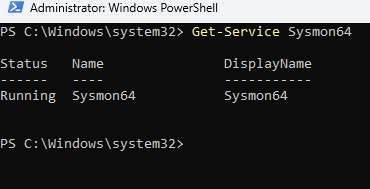

## **SwiftOnSecurity Config**
This config allows us to have a specific xml formatted output from the sysmon logs in order for Splunk to be able to properly index them. I've found that this is a widely accepted open source config which has been used in a multitude of cybersecurity projects and homelab environments.
[GitHub - SwiftOnSecurity/sysmon-config: Sysmon configuration file template with default high-quality event tracing · GitHub](https://github.com/SwiftOnSecurity/sysmon-config)

It was as simple as downloading the xml file and dropping into the sysmon security log directory as an instructional configuration file.
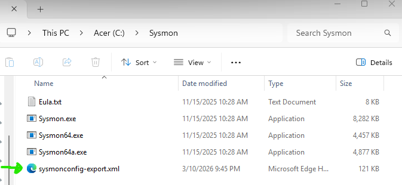

## **Universal Forwarder Installation**
 In order to receive logs on a Splunk instance, whether from a local machine or a remote endpoint, a Universal Forwarder must be deployed on the data source.
 To start I need to configure a receiving port for my Splunk index to actually catch the info we are sending it.
 
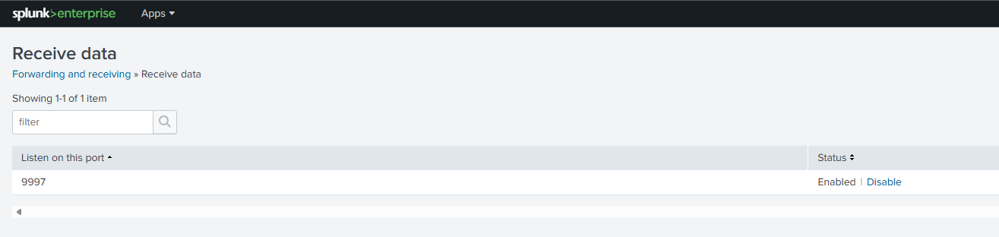

 Next I needed to configure the universal forwarder to 127.0.0.1:9997 which is the default configuration for any Splunk instance hosted locally.
 
 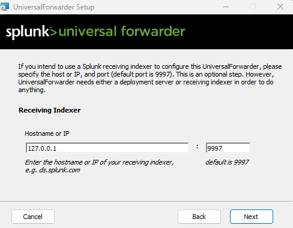
 
 In order for the index to be filled with logs we must create an input.conf file that essentially gives the Splunk forwarder instructions on what to grab and from where.
 
 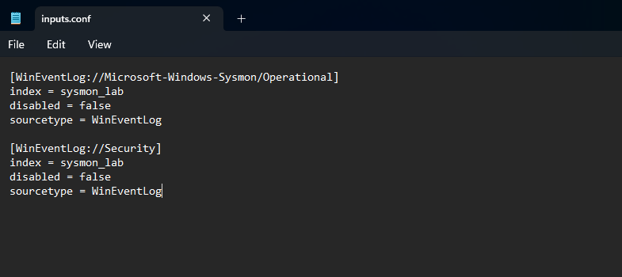
 
## **Verifying Data Flow**
 After completing the Log/Data Ingestion process I ran a simple query to confirm the flow of data into the Splunk instance.
 
 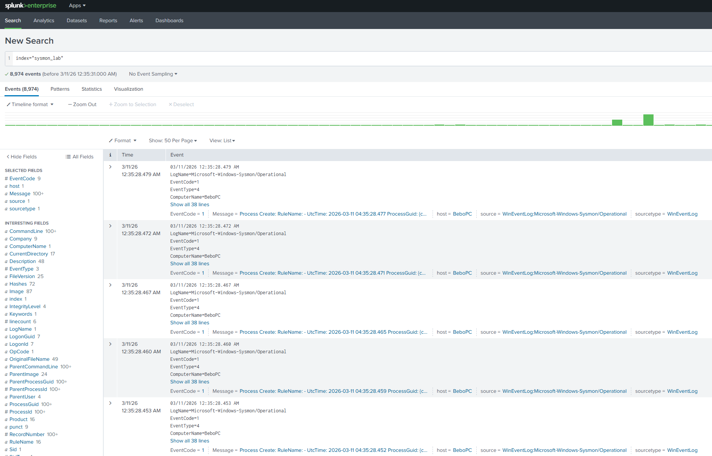

# **Brute Force Methodology** (MITRE T1110)
My thought process behind this was simulating different parts of an average intrusion attempt, as well as the results that follow. Given this objective I created an environment where I could purposely brute force attack a dummy account on my host device, and log those events into splunk. I achieved this by creating a simple python script that ran a certain amount of attempts on an account with a premade list of "common passwords" which would eventually guess the right password.  
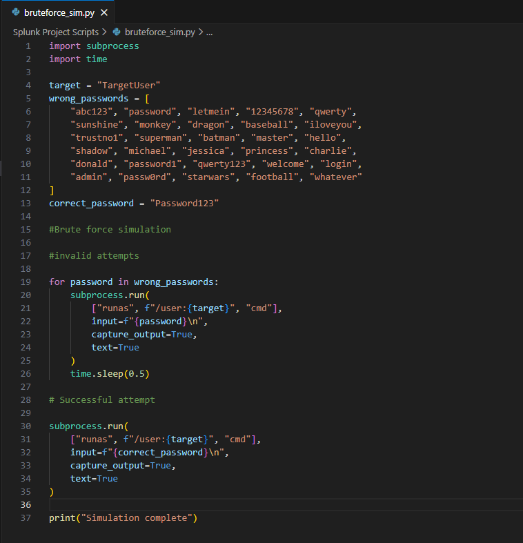

## Detection
I was able to configure a course of action to pre-emptively capture something like this before happening. Originally I was interested in creating an alert knowledge object in splunk knowing that this would be the absolute most useful given the scenario, considering that brute force attacks are one of the most common initial access vectors given that a successful brute force represents an active threat, real time notification is the ideal response. However, given the restrictions of my Splunk instance and the fact I am not able to create alerts with the Free edition, I've resorted to a report knowledge object, that could very well be scheduled through cron in order to simulate a report like detection and response system. 

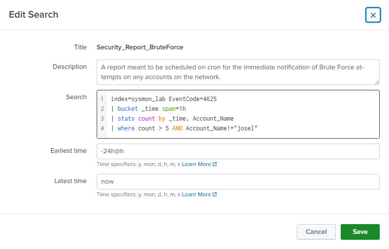

This query detects brute force attempts by searching for failed logon events (EventCode 4625) that exceed 5 occurrences within a one-hour window. To have a clean result I have also filtered out my personal account name as to capture only logs relevant to the demonstration. This makes it so that only time constricted, and sustained attacks are flagged as malicious while leaving some room for random logon failures. Running this query allows for quick observation and confirmation of any incoming brute force attacks. The following screenshot displays the 31 log on attempts stemming from one user.

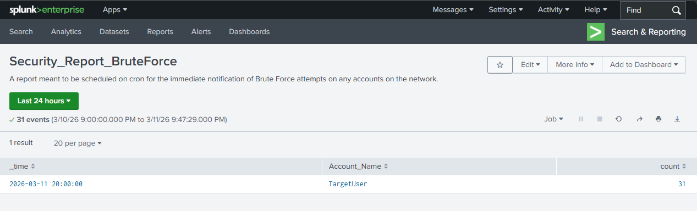

# **Privilege Escalation Methodology(MITRE T1053.005)**
Moving into the Privilege Escalation part of the simulated attack, I understood that the main goal was accomplishing admin level access to command prompts and file directories. This is typically achieved by escalating the privilege level of the account you have managed to compromise, however if the victims defensive posture doesn't allow for that, the alternative would be making use of exploits to bypass those security measures. This usually results in covertly accumulating privileges through other means and using them to execute commands under the guise of common-everyday network traffic and task execution. 

To reflect this in my simulation, I logged into the "TargetUser" account and executed a scheduled task creation command via the CMD. The task was designed to run under SYSTEM level privileges and execute two reconnaissance commands  enumerating local administrator accounts via `net localgroup administrators` and profiling the host environment via `systeminfo`  writing both outputs to a file at C:\Users\Public\out.txt. The intent was to demonstrate what an attacker would immediately do upon successful privilege escalation: identify high value accounts and map the environment for further exploitation.

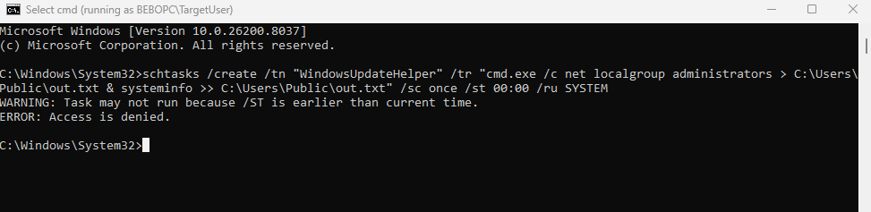

The attempt was denied by Windows access controls, returning an 'Access Denied' error  a result of TargetUser's standard user permissions being insufficient to assign SYSTEM as the executing account for a scheduled task. Despite the failed execution, the attempt itself was logged by Sysmon and represents a detectable indicator of compromise.

## Detection
Given the situational awareness established in the first phase of this simulated attack, we understand that the intruder has compromised the account "TargetUser" via brute force. This context allows us to frame the investigation moving forward with that assumed point of intrusion. Meaning, that we can run a query to scan against all of our indexes, attempting to return any results that show indicators of privilege escalation, command line execution, task scheduling, and reconnaissance that would allow for them to understand and indentify future targets within the network. 

*NOTE:(In a real world scenario, an attacker would likely pivot to a UAC bypass technique such as the fodhelper.exe registry hijack (T1548.002) to silently elevate privileges without triggering a UAC prompt. Due to lab environment constraints, this technique was not simulated to avoid modifying sensitive registry values on the host machine. For the purpose of this demonstration, elevated privileges are assumed from this point forward, reflecting the outcome of a successful UAC bypass, and the simulation continues into the persistence phase.)*

In order to track post-intrusion activity, the query below takes a broad approach, which is capturing all processes created by the "TargetUser" account following the initial brute force compromise. By filtering exclusively for Sysmon Process Creation events (EventCode 1) and narrowing our search to the target account, we can clearly observe both reconnaissance activity and privilege escalation attempts from a single perspective. This demonstrates the exact kind of granular, targeted querying that makes Splunk such a powerful tool in a SOC environment where the ability to reconstruct an attackers behavior step by step can help you prevent future endeavors.

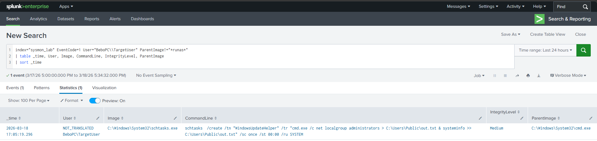

# **Persistence(MITRE T1547.001)**
For the final and most important part of the simulated attack, we are establishing persistence. This will allow the intruder to continue gathering information and securing their position within the network for future malicious activity. Typically this is achieved through methods such as creating a backdoor user account , ensuring access to the compromised machine even if the original account is flagged and locked out , deploying a reverse shell that executes on startup to maintain a reliable entry point, or modifying registry run keys to guarantee persistent execution. All three methods share the same goal: making sure the attacker can always find their way back in.

For this simulation, rather than deploying an actual reverse shell payload, a text file named `ReverseShell.txt` was dropped into the TargetUser startup folder to demonstrate the technique. Placing any executable or script at `C:\Users\TargetUser\AppData\Roaming\Microsoft\Windows\Start Menu\Programs\Startup\` guarantees it runs automatically at every login — in a real scenario this would be a malicious payload establishing a callback connection back to the attacker's machine.

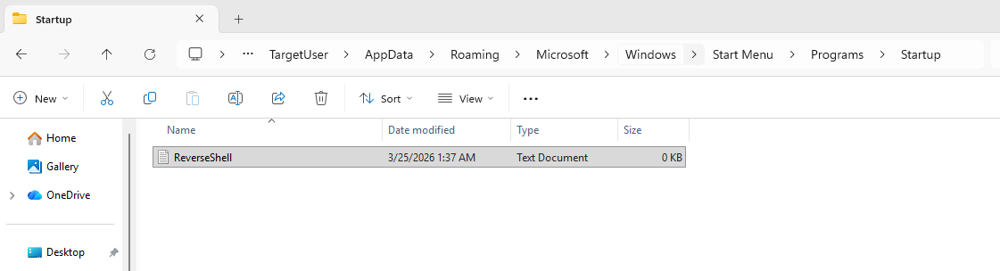

## Detection
Given the established context of a compromised `TargetUser` account originating from the brute force attack detected on March 11th, 2026, this query uses that information to generously narrow down results. Rather than searching blindly across all logs, using March 11th as the `earliest` boundary allows us to scope the search exclusively to post-compromise activity, eliminating any interference from before the intrusion occurred.

To detect persistence, the query searches for all file creation events (EventCode 11) attributed to `TargetUser` that were spawned specifically through CMD or PowerShell. This is purposeful because legitimate user activity rarely involves command line driven file creation, so filtering for `cmd.exe` and `powershell.exe` as the parent image immediately narrows results to activity that warrants further examining. Known redundant artifacts such as PowerShell's temporary script policy test files are filtered out to keep results clean and relevant. The single event returned confirms the persistence attempt `ReverseShell.txt` written directly into the TargetUser startup folder via PowerShell, a textbook indicator of an attacker securing their foothold on the compromised machine.

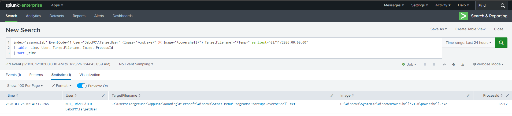

# **Conclusion**
This project successfully demonstrates a full intrusion attack chain from initial access through brute force, to privilege escalation, to the establishment of persistence all of which are detected and documented through Splunk using real Sysmon telemetry. Each phase of the attack has been mapped to the MITRE ATT&CK framework and supported by targeted SPL queries that reflect the kind of investigative techniques expected of a SOC analyst. This project represents a foundational understanding of how attackers operate and how defenders can detect, track, and respond to each stage of an intrusion. 
The skills developed here such as log pipeline configuration, threat hunting, and structured documentation form the groundwork for continued success in cybersecurity environments.
